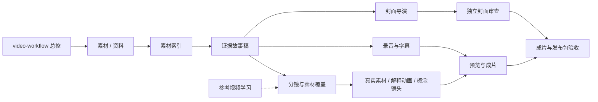

# Video Production Skills
**从素材与证据，到故事、动画、字幕、封面和交付：11 个可组合的 AI 视频制作技能。**

面向用 Codex、Claude Code 或兼容 SKILL.md 的助手做视频的创作者。中文工作说明，英文目录名；不绑定个人账号、特定音色、固定模型或操作系统。

每个 skill 都围绕一个明确任务：什么时候用、需要什么输入、如何推进、留下什么产物。可以只装一个，也可以组合全流程。仓库提供制作方法、实用校验工具和虚构演练案例；渲染、转写、配音和生视频仍由你已有的工具完成。

## 先试一个真实任务
下面的 `$skill-name` 是 Codex 调用写法；Claude Code 可按当前客户端使用 `/skill-name`。也可直接说“使用 voice-subtitle-sync 技能”，或让助手阅读安装目录的 SKILL.md；实际触发方式以客户端为准。
把自己的录音或视频交给助手：
> 使用 $voice-subtitle-sync，校对这条视频的中文字幕。保留原声、原意和原视频，输出新版本 SRT，检查人名、数字和时间轴；先不烧录字幕。

或者试一个不用密钥的虚构案例：
> 使用 $evidence-story-script，读取 examples/fictional-capacity-story.md，写一条 60 秒机制解释稿。明确这是虚构演练，不能写成新闻。给出开头承诺、证据对应和素材缺口，不生成配音或视频。

## 安装
需要 Python 3.10+。在下载或克隆后的仓库根目录执行：
```sh
python scripts/install_skills.py --target ~/.codex/skills --skill voice-subtitle-sync
python scripts/install_skills.py --target ~/.claude/skills --skill explainer-motion
```
省略 `--skill` 安装全部 11 个；参数可重复，目标可以是项目内的 `.agents/skills` 或 `.claude/skills`。安装器先预检所有冲突，已有同名目录时停止，不覆盖。安装后按客户端要求重新加载 skills 或新开会话。
`--target` 接受绝对路径，安装器自行展开 `~`，示例同样适用于 Windows；文件路径含空格时加引号。安装后的技能工具按各自 SKILL.md 指引使用技能目录的绝对脚本路径，可从任意工作目录运行。

也可手动把 `skills/<技能名>/` 整个目录复制到客户端的 skills 目录，保留 references、scripts 和 agents。不同客户端对自动触发与 UI 元数据的支持有差异；不识别时，直接让助手阅读该目录的 SKILL.md。

## 技能地图
| Skill | 适合什么时候用 | 主要产物 |
|---|---|---|
| [video-workflow](skills/video-workflow/SKILL.md) | 新作、续作、定位当前阶段 | 当前版本、阶段计划、交付状态 |
| [video-source-index](skills/video-source-index/SKILL.md) | 手里已有采访、录屏或素材 | 哈希清单、带时间码的内容索引 |
| [evidence-story-script](skills/evidence-story-script/SKILL.md) | 把已核验资料写成口播 | 故事稿、主张来源、开头兑现表 |
| [video-shot-planner](skills/video-shot-planner/SKILL.md) | 口播稳定，要找素材或排镜头 | 分镜、素材覆盖与缺口 |
| [explainer-motion](skills/explainer-motion/SKILL.md) | 解释机制、流程、因果或数据 | 状态变化、实现 Brief、预览与审查 |
| [generated-broll](skills/generated-broll/SKILL.md) | 需要概念动态镜头 | 生成计划、预算、任务恢复与验收 |
| [voice-subtitle-sync](skills/voice-subtitle-sync/SKILL.md) | 原声字幕、配音字幕或修订 | 实测时间轴、SRT、试听记录 |
| [cover-art-direction](skills/cover-art-direction/SKILL.md) | 稿件已稳定，需要发布封面 | 概念、文案、主视觉、多比例封面 |
| [cover-independent-review](skills/cover-independent-review/SKILL.md) | 封面已完成，独立检查 | 按文件版本绑定的审图报告 |
| [video-release-qa](skills/video-release-qa/SKILL.md) | 审阅成片或准备平台文案 | 分项验收、逐平台文案和交付索引 |
| [video-reference-study](skills/video-reference-study/SKILL.md) | 学教程或参考片，沉淀方法 | 观察索引、适用方法、未验证项 |


总控按已有材料进入适当阶段。只改字幕、封面或 Logo 时，复查受影响部分即可。
图中“解释动画 / 概念镜头”分别对应 explainer-motion / generated-broll；总控可按已有产物直接进入中途阶段。

## 两个小工具
以下命令在仓库根目录运行：
```sh
python skills/video-source-index/scripts/source_manifest.py clip.mp4 --output manifest.json
python skills/voice-subtitle-sync/scripts/check_srt.py captions.srt --duration 60
```
素材工具记录哈希，安装了 ffprobe 才附加媒体参数；不上传原片。字幕工具检查格式和时序，阅读速度仅给提示，不能代替听辨与手机审阅。

## 配置与边界
可复制 [project.example.json](examples/project.example.json) 到自己的**工作项目**，填写画幅、当前版本、工具与授权素材配置；样例不含凭据。路径、音色、音乐、Logo、模型和预算都由使用者决定。2D 清楚表达关系，3D 展示实体与空间，按讲解需要组合。AI 概念画面不能当作新闻证据。

样例字段是交接记录，当前工具不会自动消费或执行它：
- `schema_version: 1` 只标识这份示例结构版本；`fictional: true` 表明演练性质。
- `paths` 相对自己的工作项目；`format` 是计划规格，最终按实际文件核验。
- `tools.*: null` 表示尚未选择工具/模型，不触发安装或服务调用。
- `music_asset/voice_reference/logo_asset: null` 表示尚无选定且获授权的资产，不自动生成或替代。
- `use_generated_broll: false` 禁用生成路线；`requested_native_resolution: null` 表示未指定原生规格。
- `max_generated_groups` 是规划建议；`paid_generation_plan: null` 表示没有已确认计划。
- `external_publication: false` 表示未授权外发；改字段本身不能代替用户授权。

读图能力、正常速度播放和实际听辨缺失时，记录待验收。脚本、解码成功、静帧和响度数值各有适用范围。第三方素材许可、声音授权与平台 AI 声明要分别核对；生成、上传或发布按用户已授权范围执行。

## 开发与贡献
```sh
python scripts/validate_package.py .
python scripts/privacy_scan.py .
python -m unittest discover -s tests -v
```
[贡献方式](CONTRIBUTING.md) · [安全与隐私](SECURITY.md) · [拆分复盘](docs/design-retrospective.md) · [验证范围](docs/validation.md)

欢迎提交具体时间段的问题、可复现修复或匿名案例。如果这些 skills 帮你做出了更清楚的视频，欢迎给仓库一个 Star。

MIT 许可。第三方方法参考与许可见 [THIRD_PARTY_NOTICES.md](THIRD_PARTY_NOTICES.md)。
