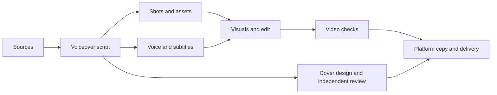

# Start here: install an assistant and finish your first task

[English home](../README.en.md) · [简体中文](getting-started.zh-CN.md) · [Troubleshooting](faq.en.md)

**Your first deliverable is a script for a fictional 60-second explainer.** You do not need to appear on camera, record a voiceover, or buy a video-generation service. You need a computer, internet access, and working access to Codex or Claude Code. Your assistant may require a subscription or usage fees; this repository's instructions and tools are open source.

## Four terms worth knowing

| Term | Meaning here |
|---|---|
| Codex / Claude Code | An assistant that can read files, create documents and run tools in your chosen folder; pick one to start |
| Skill | A reusable set of instructions describing inputs, steps, outputs and checks |
| GitHub repository | This project's files; README is its front page |
| Terminal / PowerShell | A window for commands, separate from the assistant's chat box |

A phone can become a remote entry point later. Get the computer workflow working first; see the [FAQ](faq.en.md) for the boundary. This repository does not include remote-access software, a gateway, model accounts, or a rendering service.

## Step 1: install one assistant

### Route A: Codex, starting with a graphical interface

1. Open the [official OpenAI quickstart](https://learn.chatgpt.com/docs/quickstart) and follow its desktop download link for your operating system.
2. On Windows, run the downloaded installer. On macOS, follow the installation window. Use the package for your own operating system.
3. Launch the app, sign in, and select Codex. Desktop naming and menus may change; follow the current official page.
4. After downloading this repository in the next step, open that folder in the app.

**Success looks like:** you can enter a Codex chat and choose a local folder. Resolve sign-in or access problems first; installing a Skill cannot fix account access.

### Route B: Claude Code, for existing Claude access or terminal users

Follow the [official Claude Code quickstart](https://code.claude.com/docs/en/quickstart). Choose only the command for your system. Paste it into your **system terminal, not the AI chat box**.

Windows: open **PowerShell** from the Start menu:

```powershell
irm https://claude.ai/install.ps1 | iex
```

macOS: open **Terminal**:

```bash
curl -fsSL https://claude.ai/install.sh | bash
```

These commands download and run the official installer. When it finishes, open a new terminal window and check:

```sh
claude --version
```

**Success looks like:** a version number. Later, run `claude` from the downloaded repository folder and follow the login prompts using a supported account. Native Windows and WSL are different environments; use one route consistently. See [official platform setup](https://code.claude.com/docs/en/setup).

Prefer a graphical interface? The [official desktop guide](https://code.claude.com/docs/en/desktop) links to downloads and explains the Code interface. Ordinary chat and a local Code session have different file-access and skill-loading scopes.

## Step 2: download and extract the repository

1. Open [video-production-skills](https://github.com/Ucmp0001/video-production-skills).
2. Choose **Code → Download ZIP**. You do not need to create your own repository to download this public one.
3. On Windows, right-click the ZIP and choose **Extract All**. On macOS, double-click it.
4. Open the extracted folder. You should see `README.md`, `skills`, `scripts`, and `examples` directly inside it. This is the **repository root**. If you see another folder first, open that folder too.
5. Keep it somewhere easy to find. Do not remove it during this exercise: `examples` contains the input you will use.

## Step 3: install just the story-script skill

**Manual copying is the simplest route and needs no Python.** Copy the entire `skills/evidence-story-script` folder from the repository, including `SKILL.md`, the English instructions, `references`, and `agents`.

| Assistant | Create this folder inside the repository root | Expected installed file |
|---|---|---|
| Codex, this project | `.agents/skills` | `.agents/skills/evidence-story-script/SKILL.md` |
| Claude Code, this project | `.claude/skills` | `.claude/skills/evidence-story-script/SKILL.md` |

This is a **project installation**. For another project, install there or use a personal directory as described in [advanced usage](usage.en.md). Enable file extensions in Windows Explorer if needed. On macOS, `Command + Shift + .` reveals folders whose names begin with a dot.

**How do I create `.agents/skills`?** These are two nested folders: `.agents`, then `skills` inside it. On Windows, create them in the extracted repository using Explorer's New Folder action. If macOS Finder rejects a dot-prefixed name, open Terminal, type `cd ` with a trailing space, drag the repository folder into the window and press Enter. Then run:

```bash
mkdir -p .agents/skills
```

That command is for Codex; use `mkdir -p .claude/skills` for Claude Code. Back in Finder, press `Command + Shift + .` to show the folders, then copy the entire `evidence-story-script` folder inside. Creating folders does not require Python.

**Success looks like:** `SKILL.md` is immediately inside the installed skill folder, not inside a second nested folder with the same name. If that skill is already installed, compare versions before replacing your edits.

### Optional: use the installer instead

Skip this section if you copied the folder. This installer copies skills; it does not install AI software.

1. Install Python 3.10 or newer for your operating system from [Python.org](https://www.python.org/downloads/).
2. In Windows PowerShell try `py --version`; in macOS Terminal try `python3 --version`. Continue when it reports 3.10 or newer.
3. Open a terminal at the repository root. Windows: type `powershell` into that folder's Explorer address bar and press Enter. macOS: type `cd ` with a trailing space, drag the folder into Terminal, then press Enter.
4. Run the command for your assistant and system.

Windows / Codex:

```powershell
py scripts/install_skills.py --target .agents/skills --skill evidence-story-script
```

macOS / Codex:

```bash
python3 scripts/install_skills.py --target .agents/skills --skill evidence-story-script
```

For Claude Code, replace `--target .agents/skills` with `--target .claude/skills`. If your Python executable is named `python`, use that instead of `py` or `python3`.

**Success looks like:** `Installed 1 skill(s): evidence-story-script`. A conflict means the installer has preserved your existing files; see [troubleshooting](faq.en.md).

## Step 4: open the right project and check skill access

Codex: open the extracted repository root in the app and start a new chat. Claude Code CLI: run `claude` in a terminal at that folder and complete login if needed.

If the installed skill is missing, restart the client or start a new session. Send this in the **AI chat box**:

```text
Use evidence-story-script and reply in English.
Confirm that you can read examples/fictional-capacity-story.en.md in this project.
If the skill is not discovered automatically, read the installed
evidence-story-script/SKILL.md, then its linked SKILL.en.md.
List the skill and source files you actually read; do not invent paths.
Do not generate video yet.
```

**Success looks like:** the assistant identifies the fictional capacity exercise and the actual skill file. A generic “ready” is insufficient. If it cannot find the files, give it the location of your installed folder.

## Step 5: make your first script

```text
Use evidence-story-script and read examples/fictional-capacity-story.en.md.
Write an English 60-second explainer, explicitly labeled as a fictional exercise,
not real news. Include a title, a three-second opening, full voiceover,
the closing answer, and missing visual assets.
Text only: no voice generation, no video generation, no paid media calls,
and no publication. Save to outputs/first-script.md; if it exists, save a new version.
```

**Success looks like:** `outputs/first-script.md` contains a complete script explaining “capacity is 10 orders per day, demand is 16, so the backlog grows by 6 each day,” with the fictional assumptions preserved. Sixty seconds is an estimate until real audio exists.

You have now used your first Skill. Assistant usage is still billed under your own account; this exercise adds no voice or video service.

## Step 6: add the next stage

Install `video-shot-planner` in the same way and ask it to turn your script into shots. Add voice/subtitles, explanatory motion, generated footage, and cover skills as needed.



You can use authorized footage, animation, and conceptual shots without appearing on camera. An authorized voice tool can replace recording your own narration. You choose the services, costs, and asset permissions; Skills do not supply accounts. See [advanced usage](usage.en.md) for all-skills installation and the full workflow.

Software-source check: 2026-10-08. This guide keeps installation details brief; use the linked official pages for changing menus, supported systems, and account access.
