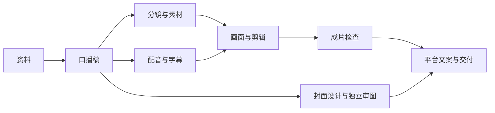

# 从零开始：装软件，跑通第一个视频任务

[中文首页](../README.md) · [English](getting-started.en.md) · [常见问题](faq.zh-CN.md)

**本教程的第一个成果是一篇60秒虚构解释稿。** 不用出镜、录音或先购买生视频服务。你需要一台电脑、网络，以及能正常使用的 Codex 或 Claude Code 账号。AI 助手本身仍可能需要订阅或按量付费；开源的是本仓库的方法和工具。

## 先认识四样东西

| 名称 | 你可以怎样理解 |
|---|---|
| Codex / Claude Code | 能在你选择的文件夹里读资料、写文件、运行工具的助手；先选一个就够 |
| Skill | 给助手的一套工作说明，规定步骤、输入、输出和检查方式 |
| GitHub 仓库 | 这个项目的文件集合；README 是首页说明 |
| 终端 / PowerShell | 输入命令的窗口；与给 AI 发消息的聊天框是两个地方 |

手机可以成为后续的远程入口。先在电脑上跑通，手机连接方式见[常见问题](faq.zh-CN.md)。本仓库不包含远程连接软件、中转、模型账号或渲染服务。

## 第1步：安装一个助手

### 路线A：Codex，适合先用图形界面

1. 打开 [OpenAI 官方快速入门](https://learn.chatgpt.com/docs/quickstart)，从页面进入适合自己系统的桌面安装入口。
2. Windows 打开下载的安装程序；macOS 按安装窗口提示安装。不要把 Windows 安装包装到 Mac 上。
3. 启动软件，完成账号登录，选择 Codex。官方桌面入口和菜单会更新，以当前官方页面为准。
4. 下一步下载好仓库后，在应用里打开那个文件夹。

**成功标志：** 你能进入 Codex 对话并选择本机文件夹。若登录或权限受阻，先处理客户端接入；复制 Skill 不能解决账号问题。

### 路线B：Claude Code，适合已有 Claude 接入或愿意用终端

参照 [Claude Code 官方快速入门](https://code.claude.com/docs/en/quickstart)。下面只选自己系统的一条，在系统终端运行，**不要发进 AI 聊天框**。

Windows：在开始菜单搜索并打开 **PowerShell**，粘贴：

```powershell
irm https://claude.ai/install.ps1 | iex
```

macOS：打开“终端”，粘贴：

```bash
curl -fsSL https://claude.ai/install.sh | bash
```

这两条会下载并运行官方安装器。安装结束后，关闭终端，重新打开一个窗口，检查：

```sh
claude --version
```

**成功标志：** 出现版本号。稍后在仓库文件夹里运行 `claude`，按提示登录；账号方式按官方指引选择。Windows 原生安装和 WSL 是不同环境，新手先按自己当前系统的一条路线走，详见[官方系统说明](https://code.claude.com/docs/en/setup)。

如果偏好界面，也可从[官方桌面文档](https://code.claude.com/docs/en/desktop)进入下载和 Code 使用说明。普通聊天窗口与本机 Code 会话的文件访问、技能加载范围不同。

## 第2步：下载并解压本仓库

1. 打开 [video-production-skills](https://github.com/Ucmp0001/video-production-skills)。
2. 点 **Code → Download ZIP**。下载公开仓库不需要先创建自己的仓库。
3. Windows 右键压缩包选“全部解压”；macOS 双击解压。
4. 打开解压后的文件夹，确认里面直接能看到 `README.md`、`skills`、`scripts`、`examples`。这层叫“仓库根目录”。如果里面还有一个同名文件夹，继续打开一层。
5. 把它放在容易找到的位置。练习期间不要删除它，`examples` 中有下一步要读的素材。

## 第3步：先装“故事稿”这一个技能

**推荐先手动复制，无需 Python。** 来源文件夹是仓库中的 `skills/evidence-story-script`。复制整个文件夹，里面的 `SKILL.md`、英文说明、`references` 和 `agents` 都要保留。

| 使用哪个助手 | 放在哪里 | 安装后应有的文件 |
|---|---|---|
| Codex，本次项目 | 仓库根目录新建 `.agents/skills` | `.agents/skills/evidence-story-script/SKILL.md` |
| Claude Code，本次项目 | 仓库根目录新建 `.claude/skills` | `.claude/skills/evidence-story-script/SKILL.md` |

这是**项目级安装**：以后换一个工作项目，需要在那里安装，或按[进阶用法](usage.zh-CN.md)安装到个人目录。Windows 如看不到扩展名，可在资源管理器开启“文件扩展名”；macOS 如看不到点开头的文件夹，按 `Command + Shift + .`。

**不会创建 `.agents/skills`？** 它表示两层文件夹：先建 `.agents`，再在里面建 `skills`。Windows 可以在解压后的仓库文件夹中右键新建文件夹。macOS 的 Finder 如果不允许点开头的名字，打开“终端”，输入 `cd `（末尾一个空格），把仓库文件夹拖进去并回车，再运行下面对应的一条：

```bash
mkdir -p .agents/skills
```

上面用于 Codex；Claude Code 用 `mkdir -p .claude/skills`。回到 Finder 按 `Command + Shift + .` 显示文件夹，再把整个 `evidence-story-script` 文件夹复制进去。创建文件夹不需要安装 Python。

**成功标志：** 目标文件夹里直接有 `SKILL.md`，不是再嵌套一层 `evidence-story-script`。已有同名技能时先比较版本，不直接覆盖自己的修改。

### 可选：喜欢命令行再用安装器

手动复制已完成就跳过本段。安装器只复制技能，不安装 AI 软件。

1. 从 [Python 官方下载页](https://www.python.org/downloads/)安装适合自己系统的 Python 3.10 或更高版本。
2. Windows 打开 PowerShell，试 `py --version`；macOS 打开终端，试 `python3 --version`。能显示3.10或更高再继续。
3. 进入仓库根目录：Windows 在该文件夹的资源管理器地址栏输入 `powershell` 并回车；macOS 在终端输入 `cd `（末尾有空格），把文件夹拖进去，再回车。
4. 运行一条与你的助手和系统对应的命令。

Windows / Codex：

```powershell
py scripts/install_skills.py --target .agents/skills --skill evidence-story-script
```

macOS / Codex：

```bash
python3 scripts/install_skills.py --target .agents/skills --skill evidence-story-script
```

Claude Code 把上述 `--target .agents/skills` 换成 `--target .claude/skills`。如果你的 Python 可执行命令是 `python`，用 `python` 替代 `py` 或 `python3`。

**成功标志：** 输出 `Installed 1 skill(s): evidence-story-script`。若显示冲突，已有文件没有被覆盖，先看[排错](faq.zh-CN.md)。

## 第4步：打开对的项目，再确认助手读到了技能

Codex：在应用中打开第2步解压的仓库根目录，开启新对话。Claude Code CLI：在这个文件夹的终端运行 `claude`，首次使用时完成登录。

安装后如技能没出现，重启客户端或新开会话。先在 **AI聊天框** 发这一段：

```text
请使用 evidence-story-script 技能，用中文回答。
先确认能读取这个工作项目的 examples/fictional-capacity-story.md。
如果技能未被自动识别，请读取已安装的 evidence-story-script/SKILL.md。
列出你实际读到的技能和素材文件，不要编造路径；先不要生成视频。
```

**成功标志：** 助手能说明“这是虚构产能案例”，并指出实际读到的技能。只回复“我会了”还不够；读不到时按提示把本机目标文件夹位置发给它。

## 第5步：复制这段话，做第一份稿子

```text
使用 evidence-story-script，读取 examples/fictional-capacity-story.md。
写一条中文60秒解释稿，明确这是虚构演练，不能写成真实新闻。
给出：标题、前三秒开头、完整口播、结尾回答、素材缺口。
只做文字，不生成配音、不生成视频、不调用付费媒体服务、不发布。
把结果另存到 outputs/first-script.md；同名文件存在就另存新版本。
```

**成功标志：** `outputs/first-script.md` 中有完整稿件，解释“产能每天10单，需求每天16单，每天多积压6单”，并写明是假设演练。60秒目前只是估计，成片按真实音频再排时间。

你已经跑通第一个 Skill。模型调用仍按自己的助手账号计费；本练习没有额外接配音/生视频服务。

## 第6步：再接下一道工序

有了稿件，再以相同方式安装 `video-shot-planner`，让助手依据稿件安排镜头。随后按需要添加配音字幕、解释动画、概念镜头和封面技能。



不出镜可以用授权素材、动画和概念镜头；不自己录口播可以用已配置并获授权的配音工具。所需服务、费用和素材许可由你选择，Skills 不附带这些账号。完整路线和批量安装见[进阶用法](usage.zh-CN.md)。

软件入口来源核对日期：2026-10-08。本文只保留入门需要的步骤，系统支持、菜单和账户权益变化请以链接中的官方说明为准。
