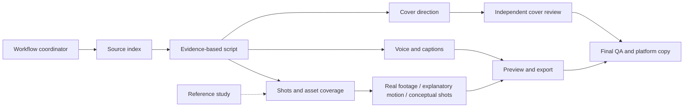

# Advanced usage and the full workflow

[English home](../README.en.md) · [简体中文](usage.zh-CN.md) · [Beginner guide](getting-started.en.md)

## Installation scopes
Run installer commands from the extracted repository root with Python 3.10+. Replace `python` with `py` on Windows or `python3` on macOS where appropriate. Manual copying needs no Python.

| Client | Personal (shared across projects) | Current project |
|---|---|---|
| Codex | `~/.agents/skills` | `.agents/skills` |
| Claude Code | `~/.claude/skills` | `.claude/skills` |

```sh
python scripts/install_skills.py --target ~/.agents/skills --skill evidence-story-script
python scripts/install_skills.py --target ~/.claude/skills --skill explainer-motion
python scripts/install_skills.py --target .agents/skills
```

Choose the destination for your client; you do not need to run all three examples. Omit `--skill` for all 11, or repeat it for multiple selections. The installer expands `~`, accepts quoted absolute paths with spaces, checks all name conflicts first and never overwrites. For project installation elsewhere, use that project's destination path while running the installer from this repository. Restart/reload according to your client if discovery is missing.

Manual installation copies the whole `skills/<name>` directory, including references, scripts, agents and both languages. `SKILL.md` remains the discovery file; English tasks read its linked `SKILL.en.md`. Codex CLI/IDE can use `$skill-name`; Claude Code can use `/skill-name` where supported. Natural-language requests and explicit file reading are fallbacks; do not assume identical UI across clients.

## Begin at your current stage



Use `video-workflow` to resume from existing artifacts. A subtitle, cover or Logo-only edit needs checks of affected parts, not an automatic full remake.

For existing audio/video:

```text
Use voice-subtitle-sync to review captions for the file I supplied.
Preserve the original recording and meaning. Save a new SRT version.
Check names, numbers and timing; do not burn captions into the video yet.
```

For a first text-only task, follow the [fictional exercise](../examples/fictional-capacity-story.en.md) and [beginner guide](getting-started.en.md).

## Two small tools
From the repository root, replace these filenames with your actual local files:

```sh
python skills/video-source-index/scripts/source_manifest.py clip.mp4 --output manifest.json
python skills/voice-subtitle-sync/scripts/check_srt.py captions.srt --duration 60
```

The manifest tool hashes local files and adds media properties when ffprobe is installed. It does not upload footage. The caption tool checks structure and timing; reading-speed warnings do not replace listening and phone-sized inspection. Use the actual measured duration instead of `60` for your own audio. Installed tools can run from any directory by using the absolute script paths described in their skills.

## Project handoff record
Copy [project.example.json](../examples/project.example.json) to your own working project if useful. It contains no credentials. You choose paths, voice, music, Logo, models and budgets. Fields are a planning record; no current tool executes this configuration:

- `schema_version: 1` identifies the example format; `fictional: true` labels the exercise.
- `paths` are relative to your working project. `format` describes intended output; inspect real exports separately.
- `tools.*: null` means no tool/model selected and triggers no installation or call.
- `music_asset/voice_reference/logo_asset: null` means no selected authorized asset; nothing is generated or substituted automatically.
- `use_generated_broll: false` disables that planned route; `requested_native_resolution: null` leaves native specification unset.
- `max_generated_groups` is a planning suggestion. `paid_generation_plan: null` means no confirmed plan.
- `external_publication: false` means publication is not authorized. Editing the field cannot replace user authorization.

Use 2D for relationships and 3D for objects/space as the explanation needs. Generated conceptual footage is not news evidence. Missing image inspection, normal-speed playback or listening remains explicit. Decoding, stills, scripts and loudness measurements have different scopes. Check specific media/voice permissions and applicable AI disclosures; generate/upload/publish only within user authorization.

## Maintenance
Run the checks in the [README](../README.en.md), follow [contribution guidance](../CONTRIBUTING.en.md), and read the [validation scope](validation.en.md). Back up customized installed skills before updating. This repository does not automatically update client skill folders or install media software.
